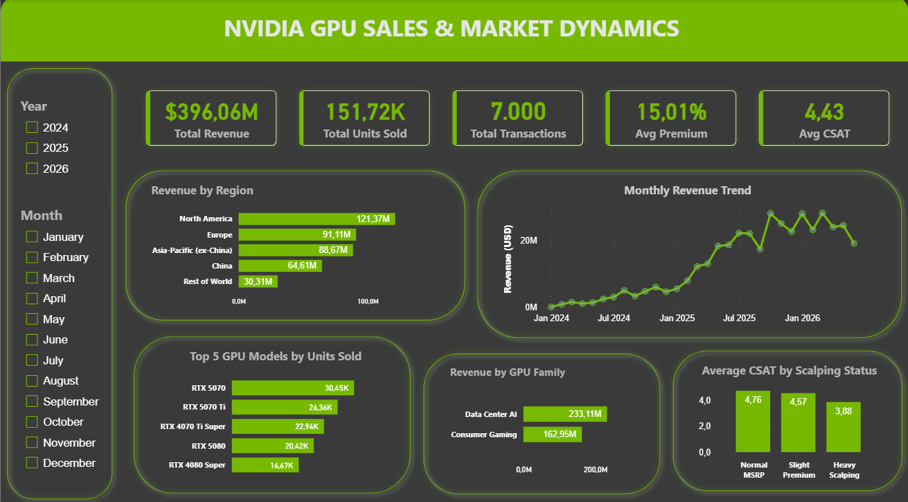

# NVIDIA GPU Sales & Market Dynamics Analysis

An end-to-end data analytics portfolio project analyzing synthetic NVIDIA GPU sales data using **Python, MySQL, and Power BI**.

The project explores sales performance, product mix, regional revenue, pricing premiums, customer satisfaction, market availability, customer segments, sales channels, bundle add-ons, and temporal trends.

> **Disclaimer:** This project uses synthetic data for portfolio and analytical practice. The findings describe patterns within the simulated dataset and do not represent actual NVIDIA sales performance.

---

## Dashboard Preview



The Power BI dashboard provides an interactive overview of sales performance with filters for **Year** and **Month**, along with cross-filtering across selected visualizations.

---

## Quick Links

- [Python Analysis](notebooks/nvidia_gpu_sales_analysis.ipynb)
- [SQL Analysis](sql/nvidia_gpu_sales_analysis.sql)
- [Power BI Dashboard](dashboard/nvidia_gpu_sales_dashboard.pbix)
- [Processed Dataset](data/processed/nvidia_gpu_sales_analysis_ready.csv)

---

## Project Overview

The dataset contains **7,000 simulated GPU sales transactions** covering Consumer Gaming and Data Center AI products.

The analytical workflow follows an end-to-end process:

**Synthetic Data Source & Ingestion → Data Quality Assessment → Data Cleaning → Feature Engineering → Exploratory Data Analysis → SQL Analysis → Power BI Dashboard**

The project is designed to demonstrate practical data analytics skills, from preparing raw data to communicating business insights through an interactive dashboard.

---

## Business Questions

This project aims to answer the following analytical questions:

1. What are the overall sales performance metrics in terms of transactions, units sold, revenue, pricing premiums, and customer satisfaction?
2. Which GPU families and models drive the highest sales volume and revenue?
3. Which regions, customer segments, and sales channels contribute the most to revenue?
4. How are pricing premiums and scalping conditions associated with customer satisfaction?
5. How does product availability relate to high-premium transactions?
6. How has revenue changed over time, and what factors appear to drive the trend?
7. How do bundle categories differ in transaction value, and to what extent may these differences reflect underlying product mix?

---

## Data Source

The raw synthetic dataset and generation script were sourced from **Nvidia GPU Sales Data 2026 (Synthetic)** by **Udit Jain** on Kaggle.

The dataset is released under the **CC0 1.0 Public Domain** license. The original generation script is included in this repository for reproducibility and further experimentation.

The script in `scripts/generate_synthetic_data.py` has been slightly adapted to align its output path with this repository's folder structure.

**Source:** [Kaggle – Nvidia GPU Sales Data 2026 (Synthetic)](https://www.kaggle.com/datasets/uditjain13/nvidia-gpu-sales-synthetic-2026)

---

## Tools & Technologies

| Area | Tools |
|---|---|
| Synthetic Data Source | Kaggle (CC0) |
| Data Processing & EDA | Python, Pandas, NumPy |
| Visualization | Matplotlib, Power BI |
| SQL Analysis | MySQL, MySQL Workbench |
| Notebook Environment | VS Code, Jupyter, Google Colab |
| Version Control | Git, GitHub |

---

## Repository Structure

```text
Nvidia-GPU-Sales-Market-Dynamics-Analysis/
│
├── README.md
├── .gitignore
├── LICENSE
├── requirements.txt
│
├── dashboard/
│   └── nvidia_gpu_sales_dashboard.pbix
│
├── data/
│   ├── raw/
│   │   └── nvidia_gpu_sales_synthetic_2026_RAW.csv
│   │
│   └── processed/
│       ├── nvidia_gpu_sales_analysis_ready.csv
│       └── nvidia_gpu_sales_sql_ready.csv
│
├── images/
│   └── dashboard_overview.png
│
├── notebooks/
│   └── nvidia_gpu_sales_analysis.ipynb
│
├── scripts/
│   └── generate_synthetic_data.py
│
└── sql/
    └── nvidia_gpu_sales_analysis.sql
```

### Folder Description

| Folder | Purpose |
|---|---|
| `data/raw/` | Original synthetic dataset sourced from Kaggle |
| `data/processed/` | Cleaned and analysis-ready datasets produced by the Python workflow |
| `notebooks/` | Python data cleaning, feature engineering, EDA, and business analysis |
| `scripts/` | Source data-generation script, adapted for repository reproducibility |
| `sql/` | MySQL business analysis queries |
| `dashboard/` | Interactive Power BI dashboard |
| `images/` | Dashboard screenshots used in project documentation |

---

## Dataset Overview

The raw dataset contains **7,000 transactions** and **17 original columns**.

Main variables include:

| Variable | Description |
|---|---|
| `sale_id` | Unique transaction identifier |
| `sale_date` | Transaction date |
| `gpu_model` | GPU product model |
| `gpu_family` | Consumer Gaming or Data Center AI |
| `launch_year` | Product launch year |
| `region` | Geographic sales region |
| `sales_channel` | Sales distribution channel |
| `customer_segment` | Customer category |
| `units_sold` | Units sold per transaction |
| `msrp_usd` | Manufacturer suggested retail price |
| `avg_street_price_usd` | Average observed market price |
| `price_premium_pct` | Percentage premium above MSRP |
| `stock_status` | Product availability status |
| `customer_satisfaction_score` | Customer satisfaction score |
| `warranty_months` | Warranty duration |
| `bundle_addon` | Additional bundle or service |
| `revenue_usd` | Transaction revenue |

---

## Data Preparation

The Python notebook performs data quality assessment, cleaning, validation, and feature engineering before exploratory and downstream analysis.

The workflow includes:

1. Dataset structure inspection
2. Missing value analysis
3. Duplicate row validation
4. Duplicate transaction ID validation
5. Descriptive statistics
6. Missing bundle handling
7. Date conversion
8. Categorical text standardization
9. Feature engineering
10. Post-cleaning validation

The original `bundle_addon` field contained **3,841 missing values**, representing approximately **54.87%** of the dataset.

These records were interpreted as transactions without additional bundles and categorized as:

```text
Standalone
```

After cleaning:

| Validation | Result |
|---|---:|
| Remaining Missing Values | 0 |
| Duplicate Rows | 0 |
| Duplicate Sale IDs | 0 |
| Final Rows | 7,000 |

---

## Feature Engineering

Additional analytical variables were created to support deeper analysis.

### Scalping Status

Transactions were categorized based on their price premium above MSRP.

| Category | Rule |
|---|---|
| Normal MSRP | Premium ≤ 5% |
| Slight Premium | Premium > 5% and ≤ 20% |
| Heavy Scalping | Premium > 20% |

Distribution:

| Scalping Status | Transactions |
|---|---:|
| Normal MSRP | 1,921 |
| Slight Premium | 3,113 |
| Heavy Scalping | 1,966 |

### Sale Month

A monthly period feature was derived from `sale_date` to support temporal sales analysis.

### High Premium Flag

Transactions with a price premium greater than **50%** were flagged for high-premium analysis.

---

## Final Processed Datasets

The Python workflow produces two processed datasets for different analytical purposes.

### Analysis-Ready Dataset

```text
data/processed/nvidia_gpu_sales_analysis_ready.csv
```

Contains:

- **7,000 rows**
- **20 columns**
- All 17 original variables
- `scalping_status`
- `sale_month`
- `high_premium_flag`

### SQL-Ready Dataset

```text
data/processed/nvidia_gpu_sales_sql_ready.csv
```

Contains:

- **7,000 rows**
- **18 columns**
- The original dataset fields
- `scalping_status`

The `sale_month` and `high_premium_flag` variables remain analysis-specific features and are not included in the SQL-ready export.

---

## Business Performance Overview

| Metric | Result |
|---|---:|
| Total Transactions | 7,000 |
| Total Units Sold | 151,719 |
| Total Revenue | $396.06M |
| Average Revenue per Transaction | $56,580.06 |
| Average Price Premium | 15.01% |
| Average Customer Satisfaction | 4.43 |

---

## Key Findings

### GPU Family Performance

Consumer Gaming dominates unit volume, while Data Center AI generates substantially higher revenue.

| GPU Family | Transactions | Units Sold | Revenue |
|---|---:|---:|---:|
| Data Center AI | 1,077 | 7,027 | $233.11M |
| Consumer Gaming | 5,923 | 144,692 | $162.95M |

Although Consumer Gaming represents the majority of product volume, Data Center AI produces greater total revenue because enterprise accelerators have substantially higher selling prices.

---

### Top GPU Models by Units Sold

| GPU Model | Units Sold |
|---|---:|
| RTX 5070 | 30,454 |
| RTX 5070 Ti | 26,361 |
| RTX 4070 Ti Super | 22,944 |
| RTX 5080 | 20,419 |
| RTX 4080 Super | 16,672 |

Consumer gaming GPUs dominate unit volume.

---

### Top GPU Models by Revenue

Data Center AI accelerators lead revenue contribution.

| GPU Model | Approx. Revenue |
|---|---:|
| B200 | $95.93M |
| H200 | $65.76M |
| H100 SXM | $46.08M |
| RTX 5090 | $31.86M |
| RTX 4090 | $25.55M |

This illustrates the difference between **volume-driven products** and **high-value enterprise products**.

---

## Pricing Premium vs Customer Satisfaction

The Pearson correlation between price premium and customer satisfaction is approximately:

```text
-0.67
```

This indicates a strong negative association within the simulated dataset: transactions with larger price premiums tend to have lower customer satisfaction scores.

> This relationship should be interpreted as an association within the synthetic dataset and not as evidence of causality.

Average satisfaction by scalping category:

| Scalping Status | Avg. Premium | Avg. Satisfaction |
|---|---:|---:|
| Normal MSRP | 2.48% | 4.76 |
| Slight Premium | 10.66% | 4.57 |
| Heavy Scalping | 34.14% | 3.88 |

---

## Customer Segment Analysis

| Customer Segment | Transactions | Units Sold | Revenue |
|---|---:|---:|---:|
| Gaming | 4,762 | 116,599 | $130.31M |
| Content Creation | 1,161 | 28,093 | $32.64M |
| Hyperscale Datacenter | 584 | 3,834 | $127.61M |
| AI Research / Startup | 314 | 1,961 | $61.52M |
| Crypto Mining | 179 | 1,232 | $43.98M |

Gaming represents the largest transaction and unit volume, while enterprise-oriented customer segments generate much higher revenue per transaction.

---

## Sales Channel Analysis

| Sales Channel | Transactions | Units Sold | Revenue |
|---|---:|---:|---:|
| Retail / Etail | 4,459 | 108,131 | $121.60M |
| Cloud Provider | 530 | 3,520 | $112.40M |
| Direct Enterprise | 370 | 2,426 | $83.95M |
| System Integrator / OEM | 1,641 | 37,642 | $78.11M |

Retail / Etail primarily supports Consumer Gaming sales, while Cloud Providers and Direct Enterprise channels are strongly associated with Data Center AI products.

---

## Temporal Analysis

The dataset covers approximately **30 months**, from January 2024 through June 2026.

Revenue generally increases over time, with several of the highest-revenue months occurring during 2025–2026.

Top monthly revenue periods include:

| Month | Revenue |
|---|---:|
| 2026-03 | $28.33M |
| 2025-10 | $28.19M |
| 2026-01 | $28.14M |
| 2025-11 | $25.17M |
| 2026-05 | $24.58M |

The analysis suggests that overall revenue growth is driven primarily by increasing transaction and unit volume rather than a sustained increase in average transaction value.

---

## Bundle Analysis

Bundle categories show substantial differences in average transaction revenue.

However, these differences should not automatically be interpreted as the causal effect of the bundle itself because bundle categories are strongly associated with different product families.

For example:

- `Support Contract` transactions are associated with Data Center AI products.
- `NVLink Cluster Install` transactions are associated with Data Center AI products.
- `Cooling Kit`, `Extended Warranty`, and `Software Bundle` transactions are primarily associated with Consumer Gaming products.
- `Standalone` transactions contain both product families.

Therefore, bundle revenue differences primarily reflect **product mix and customer segment composition**.

---

## High Premium Transactions

Transactions with a price premium greater than **50%** were analyzed separately.

| Metric | Regular Premium | High Premium |
|---|---:|---:|
| Transactions | 6,741 | 259 |
| Units Sold | 146,099 | 5,620 |
| Revenue | $368.56M | $27.51M |
| Avg. Revenue / Transaction | $54,673.69 | $106,197.38 |
| Avg. Premium | 13.33% | 58.68% |
| Avg. Customer Satisfaction | 4.48 | 3.13 |

High-premium transactions represent approximately:

- **3.70% of transactions**
- **6.94% of total revenue**

Most high-premium transactions are associated with products categorized as **Sold Out**, highlighting the relationship between simulated scarcity and pricing premiums.

---

## Business Recommendations

Based on patterns observed in the synthetic dataset:

- **Monitor high-premium transactions and product availability.** Higher pricing premiums are associated with lower customer satisfaction, particularly among Heavy Scalping transactions. Availability and pricing conditions should therefore be monitored together when identifying customer experience risks.

- **Use different strategies for Consumer Gaming and Data Center AI products.** Consumer Gaming drives the majority of unit volume, while Data Center AI generates substantially higher revenue. Performance targets and commercial strategies should reflect these different roles.

- **Prioritize channel strategies by product family.** Retail / Etail is strongly associated with Consumer Gaming volume, while Cloud Provider and Direct Enterprise channels contribute significantly to high-value Data Center AI sales.

- **Support inventory planning with demand trends.** Revenue growth in the simulated dataset is primarily associated with increasing transaction and unit volume, suggesting that inventory and capacity planning should consider changing demand levels over time.

- **Avoid evaluating bundle performance from revenue alone.** Bundle categories are associated with different GPU families and customer segments, so bundle comparisons should be evaluated within comparable product groups before drawing business conclusions.

- **Track regional performance alongside product mix.** High-revenue regions should be analyzed together with the products and customer segments driving their performance to support more targeted commercial decisions.

---

## Power BI Dashboard

The dashboard provides an interactive executive overview of the dataset.

Key KPI cards include:

- Total Revenue
- Total Units Sold
- Total Transactions
- Average Price Premium
- Average Customer Satisfaction

Main visualizations include:

- Revenue by Region
- Monthly Revenue Trend
- Top 5 GPU Models by Units Sold
- Revenue by GPU Family
- Average Customer Satisfaction by Scalping Status

Interactive slicers allow filtering by:

- Year
- Month

The dashboard file is available at:

```text
dashboard/nvidia_gpu_sales_dashboard.pbix
```

---

## SQL Analysis

The SQL component uses **MySQL** to reproduce and extend several analytical questions using the SQL-ready dataset.

The SQL script includes analyses related to:

- Overall business performance
- GPU family performance
- GPU model performance
- Regional revenue
- Customer segments
- Sales channels
- Pricing premiums
- Scalping categories
- Customer satisfaction
- Stock availability
- Bundle performance
- Monthly trends

SQL file:

```text
sql/nvidia_gpu_sales_analysis.sql
```

---

## Data Files

### Raw Dataset

```text
data/raw/nvidia_gpu_sales_synthetic_2026_RAW.csv
```

The original synthetic dataset sourced from Kaggle.

### Analysis-Ready Dataset

```text
data/processed/nvidia_gpu_sales_analysis_ready.csv
```

Contains the cleaned dataset and all engineered analytical features used in the Python analysis.

### SQL-Ready Dataset

```text
data/processed/nvidia_gpu_sales_sql_ready.csv
```

Contains the processed version prepared for import and analysis in MySQL.

---

## Reproducibility

### 1. Clone the Repository

```bash
git clone https://github.com/Faiz-Aturr/Nvidia-GPU-Sales-Market-Dynamics-Analysis.git
cd Nvidia-GPU-Sales-Market-Dynamics-Analysis
```

### 2. Create a Python Virtual Environment

```bash
python -m venv .venv
```

On Windows PowerShell:

```powershell
.\.venv\Scripts\Activate.ps1
```

### 3. Install Python Dependencies

```bash
python -m pip install -r requirements.txt
```

Required packages include:

```text
pandas
numpy
matplotlib
ipykernel
```

### 4. Synthetic Dataset Generation (Optional)

The raw synthetic dataset is already included in:

```text
data/raw/nvidia_gpu_sales_synthetic_2026_RAW.csv
```

To regenerate the dataset using the adapted Kaggle generation script:

```bash
python scripts/generate_synthetic_data.py
```

The generated file will be written directly to:

```text
data/raw/nvidia_gpu_sales_synthetic_2026_RAW.csv
```

### 5. Run the Python Analysis

Open:

```text
notebooks/nvidia_gpu_sales_analysis.ipynb
```

The notebook can be executed locally using **VS Code + Jupyter** with the project's `.venv` environment.

It was originally developed using Google Colab and remains compatible with notebook-based workflows.

The notebook automatically reads:

```text
data/raw/nvidia_gpu_sales_synthetic_2026_RAW.csv
```

and exports:

```text
data/processed/nvidia_gpu_sales_analysis_ready.csv
data/processed/nvidia_gpu_sales_sql_ready.csv
```

### 6. Run the SQL Analysis

Import the SQL-ready dataset into MySQL and execute:

```text
sql/nvidia_gpu_sales_analysis.sql
```

### 7. Open the Dashboard

Open the following file using Power BI Desktop:

```text
dashboard/nvidia_gpu_sales_dashboard.pbix
```

---

## Analytical Considerations

This project uses synthetic data and is intended to demonstrate analytical methodology rather than evaluate NVIDIA's real-world business performance.

Several findings describe relationships between variables, including pricing premiums, stock availability, bundle categories, and customer satisfaction.

These relationships should be interpreted as patterns within the simulated dataset rather than causal business conclusions.

Differences in revenue across bundles, sales channels, and customer segments may also be influenced by underlying product mix.

---

## Skills Demonstrated

This project demonstrates practical experience with:

- Data cleaning and validation
- Missing value handling
- Feature engineering
- Exploratory data analysis
- GroupBy and aggregation analysis
- Business KPI development
- Correlation analysis
- Time-series aggregation
- Customer segmentation analysis
- Pricing and market premium analysis
- MySQL querying
- Power BI dashboard development
- Data visualization
- Analytical storytelling
- Git and GitHub project organization
- Reproducible project structure

---

## Project Files

| Component | File |
|---|---|
| Python Analysis | `notebooks/nvidia_gpu_sales_analysis.ipynb` |
| Synthetic Data Generator | `scripts/generate_synthetic_data.py` |
| MySQL Analysis | `sql/nvidia_gpu_sales_analysis.sql` |
| Power BI Dashboard | `dashboard/nvidia_gpu_sales_dashboard.pbix` |
| Dashboard Preview | `images/dashboard_overview.png` |
| Raw Dataset | `data/raw/nvidia_gpu_sales_synthetic_2026_RAW.csv` |
| Analysis-Ready Dataset | `data/processed/nvidia_gpu_sales_analysis_ready.csv` |
| SQL-Ready Dataset | `data/processed/nvidia_gpu_sales_sql_ready.csv` |

---

## License & Data Attribution

The synthetic source dataset **Nvidia GPU Sales Data 2026 (Synthetic)** by **Udit Jain** is released under the **CC0 1.0 Public Domain** license.

Original source:

[Kaggle – Nvidia GPU Sales Data 2026 (Synthetic)](https://www.kaggle.com/datasets/uditjain13/nvidia-gpu-sales-synthetic-2026)

The data-generation script included in this repository originates from the same Kaggle dataset and has been adapted only to align its output path with this project's repository structure.

## Author

Created as an end-to-end data analytics portfolio project using **Python, SQL, and Power BI**.
---
*Created by [Faiz-Aturr] - Let's connect on [LinkedIn](https://www.linkedin.com/in/faizaturrahman)!*
